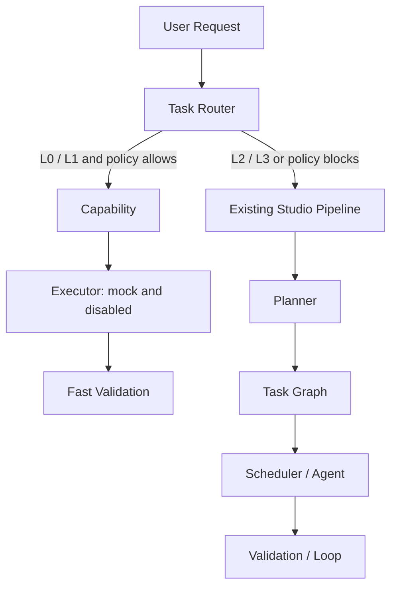

# Task Router / Fast Lane Evolution

## Problem

Small development requests currently enter the complete Studio Pipeline. This
adds Planner, Task Graph, Scheduler, multi-Agent planning, and Loop work even
when a request only changes a parameter, UI detail, configuration value, or
localized feature.

## Evidence

The v10.1 Orchestrator acceptance path contains sixteen production stages, and
the Loop may rebuild and execute the task graph for three iterations. The
repository audit identified this as repeated user friction and a Fast Build
performance blocker.

## Proposed Change

Add a deterministic Task Router with four levels:

- `L0`: parameter, UI, copy, or configuration adjustment
- `L1`: normal feature or localized bug fix
- `L2`: system-level or cross-module development
- `L3`: complete production, release, or end-to-end work

`L0` and `L1` may use the Fast Lane when allowed by
`config/task-routing.json`. `L2`, `L3`, unknown requests, and force-full signals
continue through the existing Studio Pipeline.

## Context Impact

The router is deterministic and config-driven. It does not become a new
first-read documentation family. `SKILL.md` receives only a compact routing
rule, and detailed implementation remains trigger-only.

## Fast Build Impact

Fast Lane removes Planner, Task Graph, Scheduler, and Loop from eligible L0/L1
requests. It retains capability matching, mock Executor validation, fail-fast
behavior, traceability, and a required full validation before release.

## Safety Impact

- `execution_enabled` remains `false`.
- execution mode remains `mock`.
- L2 and L3 can never enter Fast Lane.
- unknown requests default to L3.
- production and release signals force the full Studio Pipeline.
- Fast Lane cannot omit its validation stage.

## Validation Plan

- test L0, L1, L2, L3, unknown, and force-full routing
- test invalid config rejection
- test Fast Lane stage allowlist and safety flags
- preserve the complete Studio E2E test for L3
- run documentation validation, repository checks, and all tests

## Rollback Plan

Remove `task-router/` and `config/task-routing.json`, restore the Orchestrator
entry to the full pipeline, remove the router test registration, and restore
the prior E2E stage assertions. Planner, Task Graph, Scheduler, Agent,
Validation, and Loop require no rollback because their implementations are not
changed.

## Decision

`EVOLUTION_APPROVED`

## Approval

The user explicitly approved Task Router / Fast Lane implementation with the
requirement that the existing production pipeline and safety mechanisms remain
intact.
